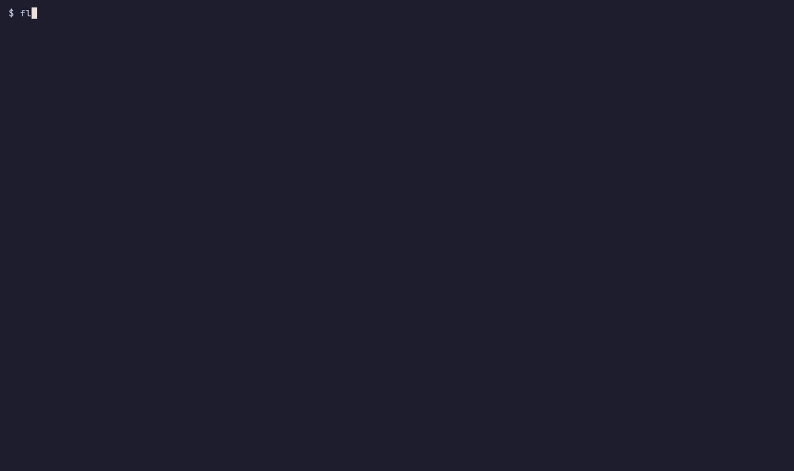
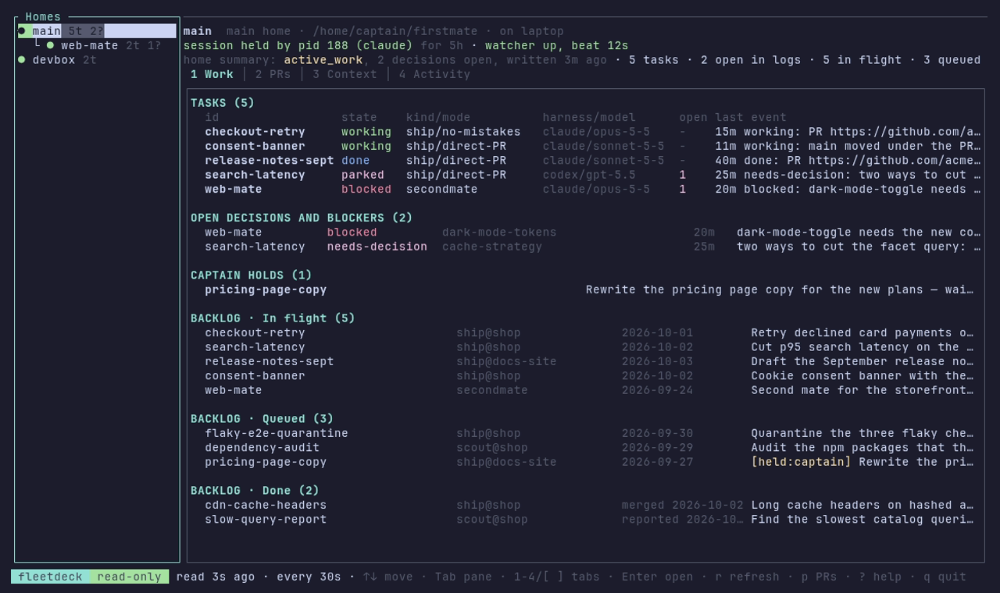
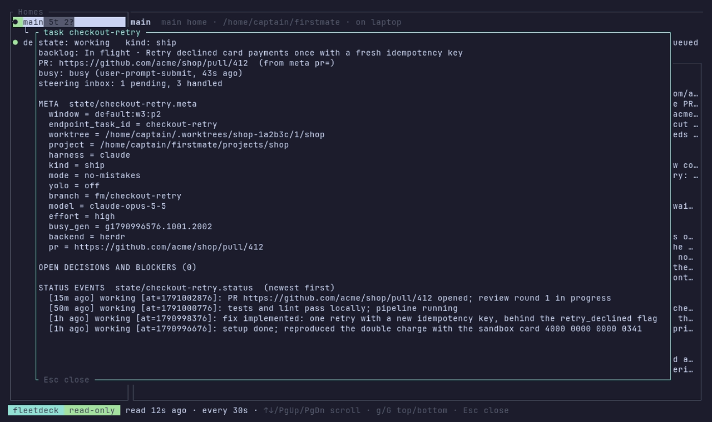
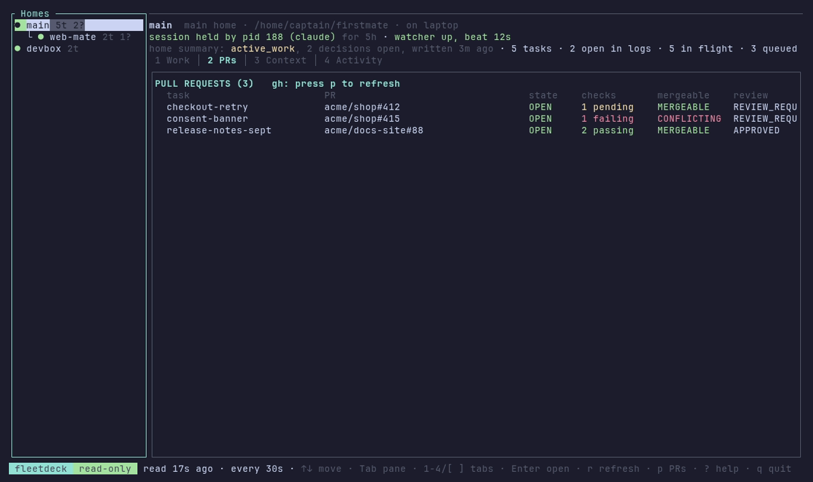

# fleetdeck

A read-only terminal dashboard for [firstmate](https://github.com/kunchenguid/firstmate) fleets.
It shows the fleet information that firstmate keeps as plain files in each home, for homes on this machine and on other machines over SSH.



The demo fleet is made-up data: a main home, a local second mate (`web-mate`) and a remote home on `devbox`.
See [Demo](#demo) to record it again.

## What it shows

For each home:

- **Homes**: the configured homes and the second mates that their `data/secondmates.md` lists, local or remote.
  Each home shows its session lock (held, stale or free, from `state/.lock` and a `ps` check of the pid), its watcher beat, and away mode.
- **Work**: the task records in `state/<id>.meta`, the current state of each task from its status log `state/<id>.status`, the open decisions and blockers, the captain holds, and the backlog in `data/backlog.md` (In flight, Queued, Done).
- **PRs**: the PR of each task (the `pr=` key in its meta, else the first PR link in its status log) and of each in-flight backlog row.
  Press `p` to read the state, checks, mergeability, review decision and unresolved review threads of each PR with `gh`.
- **Context**: the documents that are loaded into a firstmate session at start (`data/projects.md`, `data/secondmates.md`, `data/captain.md`, `data/captain-shared.md`, `data/learnings.md` and, in a second mate, `data/charter.md`), with sizes and the token estimate against `config/startup-memory-budget`.
  It also shows the files in `config/`, the projects, the second-mate routes and the other `data/*.md` documents.
- **Activity**: the queue counts (wake queue, operational inbox, task inboxes, pending replies), the most recent status events across tasks, and the tail of `state/fleet-ledger.jsonl`.

Press `Enter` on any row to open a detail view: a task with all its meta keys and status events, a decision, a backlog row with its body, a PR, a file, or a ledger record.

## Install

You need a Rust toolchain (1.88 or later) to build from source.

```sh
cargo install --git https://github.com/jayjongcheolpark/fleetdeck fleetdeck
```

From a clone of this repository, use `cargo install --path crates/fleetdeck`.

The CI workflow also builds release binaries for macOS arm64 (`aarch64-apple-darwin`) and Linux x86_64 (`x86_64-unknown-linux-gnu`).
Download them from the artifacts of a CI run on the Actions tab.

## Configure

1. Create `~/.config/fleetdeck/config.toml` (or `$XDG_CONFIG_HOME/fleetdeck/config.toml`).
2. Add one `[[home]]` entry for each main home.
   For a remote home, set `host` to an SSH alias from your `~/.ssh/config`.

```toml
refresh_secs = 30   # read every home again after this many seconds
timeout_secs = 15   # give up on a machine after this many seconds

[[home]]
name = "main"
path = "/Users/me/Developer/firstmate"

[[home]]
name = "devbox"
host = "devbox"         # ssh alias; omit for a home on this machine
path = "~/firstmate"    # ~ expands on the remote host
# discover = false      # do not add second mates from data/secondmates.md
```

You do not need to list second mates.
fleetdeck reads `data/secondmates.md` in each configured home and adds every route it finds: a local route on the same machine as its parent, and a `host:` route over SSH.

Without a config file, fleetdeck shows `$FM_HOME`, or the current directory when it is a firstmate home.
You can also pass homes on the command line:

```sh
fleetdeck --home ~/Developer/firstmate --ssh devbox:~/firstmate
```

## Use

| Key | Action |
| --- | --- |
| `↑`/`↓`, `j`/`k` | Move in the focused pane |
| `Tab`, `←`/`→` | Move between the home list and the content |
| `1` `2` `3` `4`, `[` `]` | Work, PRs, Context, Activity tabs |
| `Enter` | Open the selected row in the detail view |
| `Esc` | Close the detail view |
| `r` | Read every home again now |
| `p` | Read PR status with `gh` |
| `?` | Help |
| `q` | Quit |

Other modes:

- `fleetdeck --json` prints the collected snapshots as JSON.
- `fleetdeck --frame 160x45 --tab work --select 0` prints one rendered frame as text.

## Screenshots

The Work tab shows the tasks, the open decisions and blockers, the captain holds and the backlog of the selected home:



`Enter` opens the selected row in a detail view:



`p` reads each PR with `gh`:



## The read-only guarantee

fleetdeck never writes, moves or deletes anything in a home, and it never changes fleet state.

- **One read-only script does all home access.**
  [`crates/fleetdeck-core/src/gather.sh`](crates/fleetdeck-core/src/gather.sh) is the complete set of commands that fleetdeck runs on a machine that holds a home.
  It only uses `head`, `tail`, `ls`, `stat`, `wc`, `awk`, `tr`, `ps`, `date`, `hostname` and `uname`, and its only redirections go to `/dev/null`.
  fleetdeck runs it with `sh -s` for a local home and with `ssh <alias> sh -s` for a remote home, so both paths are the same code.
- **No firstmate scripts.**
  fleetdeck parses the files directly.
  It does not run `fm-fleet-snapshot.sh` or `fm-bearings-snapshot.sh`, because they refresh a cache under `state/`.
  It does not run `fm-crew-state.sh` either, because that script reads terminal panes and calls the forge.
- **No acknowledgements.**
  Queues are counted, never drained: the wake queue, the operational inbox and the task inboxes stay exactly as they are.
  fleetdeck sends no keys to terminal panes and sends no signals to processes.
  Liveness comes from `ps -p <pid>` only.
- **Secrets are not read.**
  Files in `config/` whose names contain `password`, `secret`, `token`, `credential`, `key` or `.bak`, or end in `.env`, are shown by name and size only.
- **GitHub is read-only.**
  The PR tab uses `gh pr view --json …` and one `gh api graphql` query for review threads.
  It never posts, edits, approves or merges.
- **Remote reads go straight to the files.**
  SSH runs the gather script under the login shell of the remote account.
  fleetdeck does not use firstmate's `fm-on.sh` remote job channel, so it does not interrupt the parent's reply mirror.

The integration test [`tests/fake_home.rs`](crates/fleetdeck-core/tests/fake_home.rs) builds a fake main home and second mate, collects them, and checks that every path, byte and modification time is unchanged.

## Layout

- `crates/fleetdeck-core`: the data collection library, with no terminal code.
  `collect::collect_fleet` returns one `model::HomeSnapshot` per home.
  Another front end can reuse it.
- `crates/fleetdeck`: the ratatui terminal UI.

The parsers follow the producers in firstmate: `bin/fm-classify-lib.sh` for status lines and open decisions, the tasks-axi markdown grammar for the backlog, `bin/fm-secondmate-registry-lib.sh` for second-mate routes, `bin/fm-project-mode.sh` for projects, and `docs/fleet-ledger.md` for the ledger.

## Limits

- The task state comes from the status log, the same way `fm-crew-state.sh` falls back to it.
  fleetdeck does not look at terminal panes, so it cannot tell a working pane from an idle one beyond the busy-state file.
- A status log larger than 1 MiB is read from its end only, so a decision that was opened before that point and never closed does not show in the Work tab.
  The home summary line still shows firstmate's own count from `state/home-summary.json`.
- A remote route listed by a remote home (a second mate on a third machine) is skipped.
- PR status supports github.com only.

## Demo

The GIF and the screenshots come from [`demo/demo.tape`](demo/demo.tape), a [vhs](https://github.com/charmbracelet/vhs) script.
To record them again, install Docker and run:

```sh
demo/record.sh
```

The script builds fleetdeck and runs vhs in a container.
[`demo/setup.sh`](demo/setup.sh) builds the demo fleet from [`demo/homes`](demo/homes).
In the container, small stand-ins in [`demo/bin`](demo/bin) replace `ssh`, `gh` and `hostname`.
The "remote" home is read through fleetdeck's real ssh transport, but from a local directory, and the PR data is made up, so the recording makes no network calls.

## License

[MIT](LICENSE)
